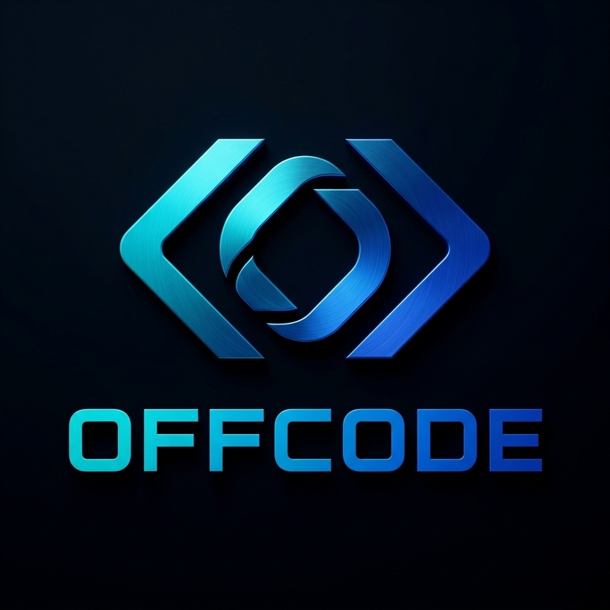

# Offcode ⚡

<p align="center">
  
</p>

**Offcode** is a deterministic, educational programming assistant built as a Visual Studio Code extension. It translates natural language programming prompts into verified, production-grade, beginner-friendly **C++17** implementations—completely offline and without relying on large language models (LLMs) or external generative APIs.

---

## Key Highlights

- **Zero LLM Hallucinations**: 100% deterministic NLP parsing and code generation. Every generated fragment is statically verified, compilable, and standards-compliant.
- **Strict Scope Discipline**: When generating menu-driven programs, Offcode generates menus containing **only** the operations requested by the user, avoiding unwanted menu bloat.
- **Dynamic Memory Safety**: Automatically generates proper memory deallocation routines (`freeList`, destructor cleanup) for linked lists and dynamic structures to prevent memory leaks.
- **Interactive Terminal Input**: Programs accept input dynamically via standard terminal I/O (`cin` / `cout`) with clean, educational prompts.
- **Zero External Runtime Dependencies**: The core NLP engine relies exclusively on Python standard library modules (`difflib`, `re`, `json`).

---

## Supported Domains & Operations

### 1. Data Structures
- **Singly Linked Lists (SLL)**: Insert (beginning, end, after node, position), Delete (beginning, end, value, position), Display, Reverse, Search, Count, and Scoped Menu programs.
- **Doubly Linked Lists (DLL)**: Two-way pointer manipulation, Insert, Delete, Forward & Backward Display, and Scoped Menus.
- **Circular Linked Lists (CLL)**: Cycle preservation, Insert, Delete, Display, Search.
- **Doubly Circular Linked Lists (DCLL)**: Full circular doubly-linked pointer rewiring, Insert After, Create/Initialize List, Display, Scoped Menus.
- **Stacks**:
  - Implementations: Array-based static stack, Linked-List dynamic stack (`freeStack`), Min Stack with $O(1)$ `getMin()`, Two Stacks in one array, $K$ Stacks in a single array.
  - Expression Conversions: Infix to Postfix, Infix to Prefix, Postfix to Infix, Prefix to Infix, Postfix to Prefix, Prefix to Postfix.
  - Expression Evaluations: Postfix evaluation, Prefix evaluation, Infix expression evaluation.
  - Parentheses & Brackets: Balanced parentheses check, Redundant brackets detection, Longest valid parentheses substring.
  - Monotonic & Classic Applications: Next Greater Element (NGE), Next Smaller Element (NSE), Previous Greater Element (PGE), Previous Smaller Element (PSE), Stock Span Problem, Largest Rectangle in Histogram, Trapping Rain Water, Celebrity Problem.
  - Transformations: Reverse string, Reverse stack using recursion, Sort stack using recursion, Delete middle element, Decimal to binary conversion.
- **Queues**:
  - Implementations: Linear Queue (array), Circular Queue (ring buffer), Linked-List Queue (`freeQueue`), Double-Ended Queue (Deque), Priority Queue (heap/array).
  - Classic Applications: Reverse queue (recursive & stack), Reverse first $k$ elements, Generate binary numbers from 1 to $N$, First non-repeating character in a stream, Interleave queue halves, Sliding window maximum (monotonic deque), First negative integer in every window of size $k$, Circular tour / petrol pump problem, Sort queue using stack.
  - Cross-Structure Composition: Queue using two stacks, Stack using two queues.

### 2. Algorithms
- **Searching**: Linear Search, Binary Search.
- **Sorting**: Bubble Sort, Selection Sort, Insertion Sort, Merge Sort, Quick Sort.
- **Polynomial Arithmetic**: Linked-list-based polynomial addition and evaluation.

### 3. Numerical Methods
- **Linear Systems**:
  - Doolittle LU Decomposition (Singularity & zero-pivot protection, $L\mathbf{y}=\mathbf{b}$, $U\mathbf{x}=\mathbf{y}$)
  - Gaussian Elimination (with partial pivoting)
  - Gauss-Jordan Elimination
  - Jacobi Iteration
  - Gauss-Seidel Iteration
- **Root Finding**: Bisection Method, Regula Falsi (False Position), Newton-Raphson, Secant Method.
- **Interpolation**: Lagrange Interpolation, Newton Forward / Backward Difference, Newton Divided Difference.
- **Numerical Calculus & ODEs**: Trapezoidal Rule, Simpson's 1/3 and 3/8 Rules, Euler's Method, Modified Euler, Runge-Kutta 4th Order (RK4), Power Method for Eigenvalues.

---

## How It Works

```text
Natural Language Query (User Input in VS Code Command Palette)
                     ↓
VS Code TypeScript Extension (`src/extension.ts`)
                     ↓ (stdin JSON)
Deterministic Python NLP Engine (`python_parser/parser.py`)
                     ↓ (stdout JSON)
Structured `ProblemSpec` Specification
                     ↓
TypeScript Operation Resolver (`src/resolver/operationResolver.ts`)
                     ↓
Verified C++ Code Generator (`src/generator/cppGenerator.ts` & `menuGenerator.ts`)
                     ↓
Active VS Code Editor Tab (Opens Clean, Ready-to-Compile C++17 Solution)
```

---

## Installation

### Method A: Install via VS Code Marketplace
Search for **"Offcode"** in the VS Code Extensions tab (`Ctrl+Shift+X`) and click **Install**.

### Method B: Install via VSIX (Direct)

1. Download the latest `offcode-2.2.0.vsix` release from [GitHub Releases](https://github.com/abdullahalmamun29/chup/releases).
2. In VS Code, open the Extensions view (`Ctrl+Shift+X` or `Cmd+Shift+X`).
3. Click the **`...`** (Views and More Actions) menu in the top-right corner of the Extensions panel.
4. Select **Install from VSIX...** and choose `offcode-2.2.0.vsix`.

### Method C: Build from Source

```bash
# 1. Clone the repository
git clone https://github.com/abdullahalmamun29/chup.git
cd chup

# 2. Install dependencies & compile
npm install
npm run compile
```

To run and debug locally:
1. Open the project folder in VS Code.
2. Press `F5` to open the **Extension Development Host** window.

---

## Usage

1. In VS Code, press **`Ctrl + Shift + P`** (or `Cmd + Shift + P` on macOS) to open the Command Palette.
2. Type **`Offcode: Generate C++ Solution`** (or `Offcode: Open Problem Solver`) and hit **Enter**.
3. Enter your natural language prompt. Examples:
   - *"generate a menu driven program for creating, inserting a value after a given node and displaying the list in a doubly circular linked list."*
   - *"implement Lu decomposition Method"*
   - *"create a singly linked list with insert at beginning and delete at end make it menu driven"*
   - *"bisection method with user input"*
4. A new tab opens instantly with complete, verified C++ code ready to compile and run.

---

## Testing & Quality Assurance

Offcode is tested against a comprehensive test matrix covering interpretation, scope boundaries, menu overreach prevention, and edge cases:

```bash
# Run the 892-assertion comprehensive regression suite
python3 scripts/evaluate_user_suite.py

# Run TypeScript unit & integration tests
npm test
```

---

## Environment & Runtime Requirements

### 1. Python Runtime Requirements
Offcode includes a production-grade, cross-platform Python runtime resolution layer that automatically locates and validates a compatible Python environment.

- **Supported Python Versions**: `Python >= 3.8` (CPython Major Version 3).
- **Zero Third-Party Packages**: Offcode's reasoning engines and NLP parser rely solely on standard library capabilities (`sys`, `os`, `json`, `math`, `heapq`, `typing`, `dataclasses`, `collections`, `itertools`). No `pip install` steps are required.
- **Platform-Aware Automatic Discovery**:
  - **Windows**: Discovers explicit configuration, VS Code selected interpreter, active virtual environments (`VIRTUAL_ENV`, `CONDA_PREFIX`), workspace `.venv`, the Windows `py` launcher (`py -3`, `py`), `python.exe` / `python3.exe` on PATH, and standard installation directories (such as `C:\Python312\python.exe` or `%LOCALAPPDATA%\Programs\Python\Python3*`).
  - **Linux**: Discovers explicit configuration, VS Code selected interpreter, active virtual environments, workspace `.venv`, `python3` / `python` on PATH, and standard system paths (`/usr/bin/python3`, `/usr/local/bin/python3`).
  - **macOS**: Discovers explicit configuration, VS Code selected interpreter, active virtual environments, workspace `.venv`, `python3` on PATH, and Homebrew paths (`/opt/homebrew/bin/python3` on Apple Silicon, `/usr/local/bin/python3` on Intel).
- **Non-PATH Installations Supported**: If Python is installed in a standard location but not added to your system `PATH`, Offcode will still locate and validate it automatically without requiring you to manually modify system environment variables.

### 2. Configuration Setting: `offcode.pythonPath`
If you maintain Python at a custom location or wish to pin a specific interpreter:
1. Open VS Code Settings (`Ctrl+,` or `Cmd+,`).
2. Search for `offcode.pythonPath` (or legacy `chup.pythonPath`).
3. Provide the absolute filesystem path to your Python executable (e.g. `C:\Python312\python.exe` or `/usr/bin/python3`).
> **Note**: This setting must be an executable file path, not an arbitrary shell command.

### 3. Environment Diagnostics: `Offcode: Diagnose Environment`
To inspect the status of your Python runtime and C++ toolchain:
1. Open the Command Palette (`Ctrl+Shift+P` / `Cmd+Shift+P`).
2. Run **`Offcode: Diagnose Environment`**.
3. A detailed report will display:
   - System architecture and OS.
   - Python executable, concrete binary, version, discovery source, and bootstrap status.
   - C++ compiler path, version, and C++17 compilation probe status.
   - Overall health status: **READY**, **DEGRADED** (Python ready, C++ compiler missing), or **BLOCKED** (Python unavailable).

### 4. C++ Verification Toolchain (Decoupled)
To compile and automatically verify generated C++ solutions against test cases, Offcode requires a C++17 compiler (`g++` or `clang++` supporting `-std=c++17`):
- **Linux**: Install via package manager (e.g. `sudo apt install g++`).
- **macOS**: Install via Xcode Command Line Tools (`xcode-select --install`) or Homebrew (`brew install gcc`).
- **Windows**: Install via MinGW-w64 (MSYS2) or Visual Studio Build Tools.
> C++ toolchain detection is decoupled from Python discovery. If a C++ compiler is not detected, Python reasoning and code generation remain fully functional while automated verification is cleanly marked unavailable.

---

## License

This project is licensed under the [MIT License](LICENSE).

